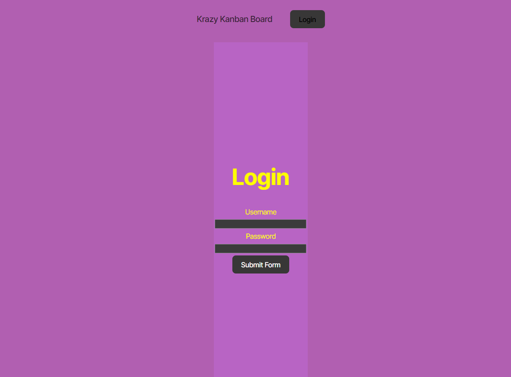
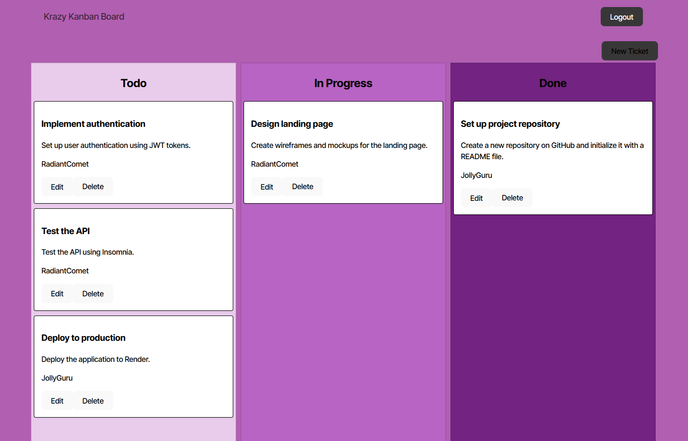

# Kanban Board

 <!--not deployed yet  -->

  
  

## Description

This application is a full-stack Kanban board designed for agile teams, with added functionality for secure user authentication using JSON Web Tokens (JWT). Users can securely log in to manage tasks, track their work, and collaborate with team members in real-time. The app includes authentication to ensure that only authorized users can access and modify tasks.

Visit the app on the [Link](https://kanban-board-1vhq.onrender.com).


## Table of Contents

- [Kanban Board](#kanban-board)
  - [Description](#description)
  - [Table of Contents](#table-of-contents)
  - [Installation](#installation)
    - [Local Installation / Testing](#local-installation--testing)
  - [Usage](#usage)
  - [Tests](#tests)
  - [License](#license)
  - [Contributing](#contributing)


## Installation

### Local Installation / Testing

1. Clone the rep

```
git clone https://github.com/parsamh8/kanban_board
```

2. Install dependencies

```
npm i
```

3. Seed the database

```
npm run seed
```

4. Launch the app in development environment

```
npm run start
```

5. Visit app:

[http://localhost:3001/](http://localhost:3001/)


## Usage

To use the Kanban Board application, start by navigating to the login page. If you’re a new user, create an account to access the board. Log in with your username and password, which will generate a JSON Web Token (JWT) stored securely in your browser’s local storage. Once authenticated, you’ll be redirected to the main Kanban board, where you can add, update, and organize tasks by dragging them between columns labeled To Do, In Progress, and Done. When finished, log out to clear the JWT and end your session, or allow the session to expire after a period of inactivity, which will automatically redirect you to the login page. The board also includes bonus features to sort and filter tasks, making task management even more intuitive and efficient.






## Tests

Application tested with Insomnia.


## License

This project is licensed under the MIT License.


## Contributing

Feel free to fork the repository and submit pull requests if you'd like to contribute!

Buy me a coffee? ☕
My contact info: parsamh8@gmail.com
